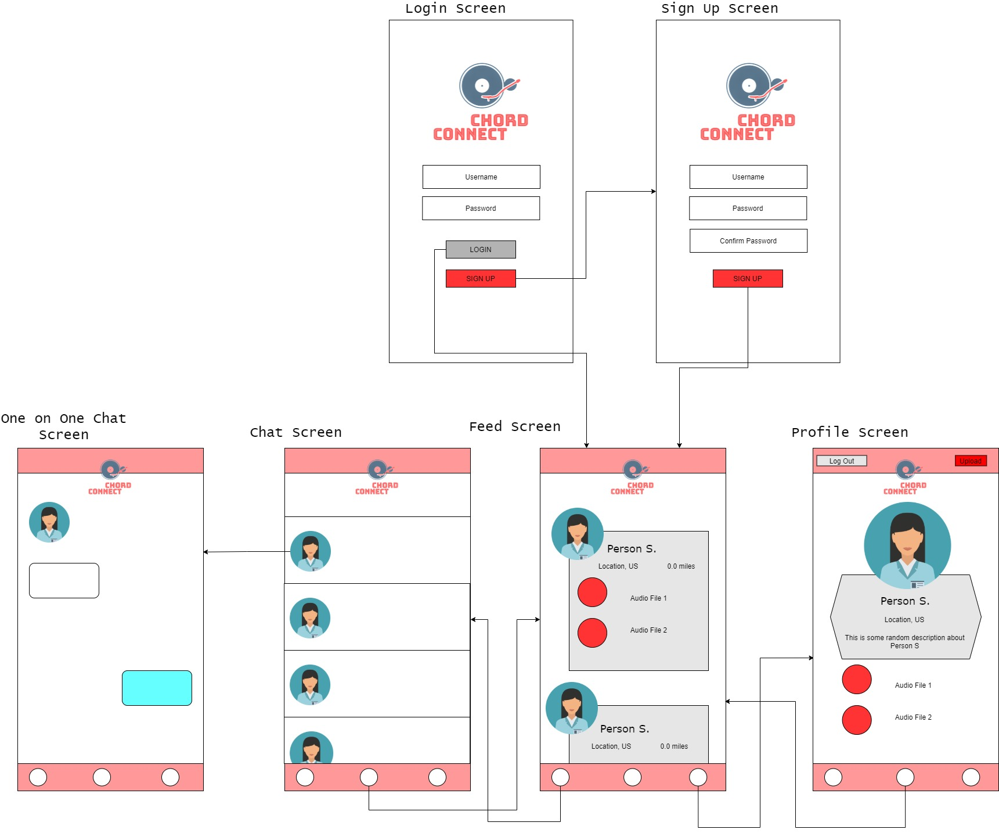

# CHORD CONNECT

## Table of Contents
1. [Overview](#Overview)
1. [Product Spec](#Product-Spec)
1. [Wireframes](#Wireframes)
2. [Unit 8 Progress](#Unit 8 Progress)

## Overview

### Description
Chord Connect is a social android app that helps musicians connect with other musicians within their proximity and hear each other's music.

### App Evaluation
[Evaluation of your app across the following attributes]
- **Category:** Social/Music
- **Mobile:** Android first experience, uses user location and audio files, parse database
- **Story:** Allows musicians to connect with other musicians based on proximity; check out each other's music and profile pic; chat with each other 
- **Market:** Individuals who like composing music/instrumentals and collaborate with other individuals
- **Habit:** Users can post their profile picture, audio files, connect with other musicians via chat, and pinpoint distance difference from other individual
- **Scope:** Penn State University Park

## Product Spec

### 1. User Stories

**Required Stories**

* [x] Users can sign up
* [x] Users can log in 
* [x] Users can stay logged in if they exit out of the app without logging out
* [x] Users can log out
* [ ] Users can post their profile picture
* [ ] Users can enter their address information (to locate other musicians)
* [ ] Users can post audio files 
* [ ] Users can view their own audio files in their profile
* [ ] Users can have a sneak peek of other user's audio files and profile picture
* [ ] Users can chat with each other
* [ ] User can locate musicians near their area (proximity feature/GPS)

**Stretch Stories**

* [ ] Users can duet with other users
* [ ] Users can comment on other user's audio fies
* [ ] Users can like other audio files
* [ ] Users can post a video of them playing an instrument

### 2. Screen Archetypes

* Login Screen
   * Users can log in to their account
* Sign up Screen
   * Users can register and sign up an account
* Profile Screen
   * Users can view their profile (profile, audio files)
* Chat Screen
   * Users can look and chat with other users
* One-on-One Chat Screen
   * Users can chat with a specific user
* Feed Screen
   * Users can see other users, their 2 audio files, and distance from their location

### 3. Navigation

**Tab Navigation** (Tab to Screen)

* Profile
* Chat
* Feed

**Flow Navigation** (Screen to Screen)

* Login Screen
   * --> Feed Screen
* Sign up Screen
   * --> Feed Screen
* Profile Screen
   * --> Chat Screen
   * --> Feed Screen
* Chat Screen
   * --> One-on-One Chat Screen
   * --> Feed Screen
   * --> Profile Screen
* Feed Screen
   * --> Chat Screen
   * --> Profile Screen

## Wireframes

## Unit 8 Progress

